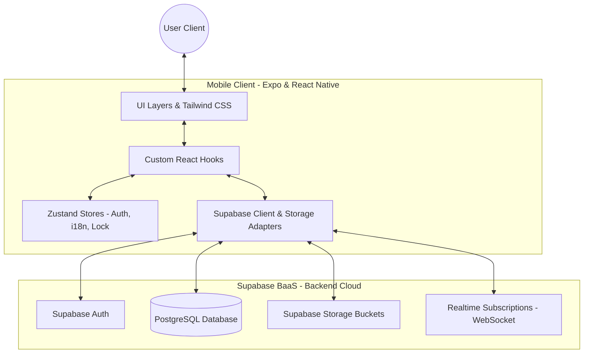
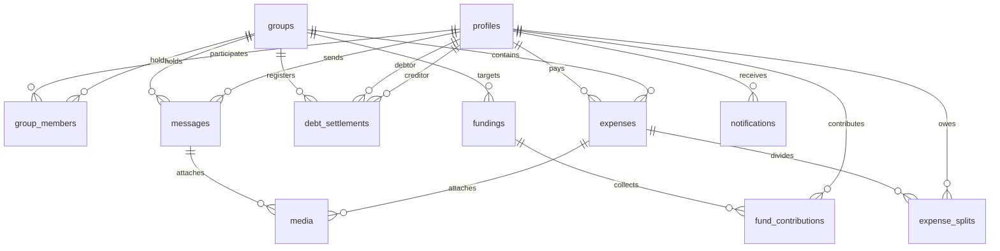

# 🚀 EasySplit: Group Expense Tracker & Debt Settler

EasySplit is a premium, feature-rich mobile application designed for seamless group expense tracking, debt simplification, and shared savings funds. The application is specifically optimized for Vietnamese users, featuring automatic language detection (English/Vietnamese), custom VNĐ formatting, and an elegant **"Sunrise Glass" UI** design language.

It leverages a modern BaaS (Backend-as-a-Service) model with **React Native (Expo SDK 55)** on the frontend and **Supabase (PostgreSQL)** on the backend.

---

## 📖 Table of Contents

1. [Key Features](#-key-features)
2. [Aesthetics & Design System ("Sunrise Glass")](#-aesthetics--design-system-sunrise-glass)
3. [System Architecture](#-system-architecture)
4. [Folder Structure](#-folder-structure)
5. [Database Schema & Logic](#-database-schema--logic)
    - [Database Relational Model](#database-relational-model)
    - [Row-Level Security (RLS) Policies](#row-level-security-rls-policies)
    - [Database Functions & Triggers](#database-functions--triggers)
6. [Core Technical Implementations](#-core-technical-implementations)
    - [Precision Split Engine (Largest Remainder Method)](#1-precision-split-engine-largest-remainder-method)
    - [Secure Storage Adapter (Token Chunking)](#2-secure-storage-adapter-token-chunking)
    - [Biometric Shield Lock](#3-biometric-shield-lock)
    - [Greedy Debt Netting Algorithm](#4-greedy-debt-netting-algorithm)
7. [Local Setup & Installation](#-local-setup--installation)
    - [Prerequisites](#prerequisites)
    - [Backend Setup (Supabase CLI)](#backend-setup-supabase-cli)
    - [Frontend Setup (Expo Client)](#frontend-setup-expo-client)
8. [Developer Workflow & Naming Conventions](#-developer-workflow--naming-conventions)

---

## ✨ Key Features

EasySplit organizes its features into 5 distinct epics:

### 1. Identity, Access, & Security (EPIC 1)
- **Email/Password Auth**: Handled securely via Supabase Auth.
- **Biometric Shield**: Opt-in app lock using Face ID / Touch ID hardware (`expo-local-authentication`). Re-locks the application instantly when backgrounded or inactive.
- **Secure Token Chunking**: Custom storage adapter solving the OS-level 2KB storage limit for SecureStore.
- **Dynamic Localization (i18n)**: English/Vietnamese language toggle. Automatically detects device system locale via Hermes `Intl` API on startup.

### 2. Group Management & Administration (EPIC 1 & 2)
- **Group Creation**: Set name, description, custom cover picture, and budget limits.
- **Unique Invite Codes**: Generates 6-character unique codes for member lookup. Joining uses a database RPC (`join_group_by_code`) to bypass read restrictions securely.
- **Add Members Directly**: Search users in the app by name/email (excluding existing members) and add them instantly.
- **Zero-Balance Safety Checks**: Admins can remove members and members can leave groups *only* if their outstanding net balance is exactly zero, ensuring no debts are orphaned.

### 3. Core Expense Engine & Global Feed (EPIC 2)
- **Multi-Category Expenses**: Organize expenses under *Food, Coffee, Transport, Shopping, or Others*.
- **Receipt Images**: Attach photo receipts uploaded directly to Supabase Storage.
- **Global History Feed**: A consolidated timeline aggregating transactions across all groups the user belongs to.
- **Precision Splitting**: Even split distribution calculation utilizing the *Largest Remainder Method* to avoid rounding leaks.

### 4. Smart Settlements & Netting (EPIC 3)
- **Greedy Netting (`simplifyDebts`)**: Opt-in debt netting algorithm minimizing the number of transfer transactions between members.
- **2-Step Verification**: Debtors submit proof of payment (screenshot) -> Creditors receive notifications -> Creditors verify and confirm the receipt to clear the debt.

### 5. Group Shared Funds & Real-Time Chats (EPIC 3 & 4)
- **Piggy Bank Goal**: Create co-contribution savings targets with progress bars. Members deposit money with proof -> Admin approves -> Fund progress updates.
- **Real-Time Group Chat**: Instant messages with image attachments, synchronized over a WebSocket subscription channel.
- **Triggered In-App Notifications**: Real-time notifications for new expenses, chat messages, and settlements generated at the database level.

---

## 🎨 Aesthetics & Design System ("Sunrise Glass")

The visual interface is built upon a cohesive **"Sunrise Glass"** theme. Rather than plain inputs or simple lists, EasySplit utilizes a playful, organic glassmorphism feel:

- **Mesh Background**: A full-screen mesh gradient (`MeshBackground.tsx`) transitioning from Deep Indigo (`#2E3192`) to Dark Violet (`#1B1464`).
- **Accent Elements**: Sunset Coral gradients (`#FF512F` to `#DD2476`) indicating main actions.
- **Frosted Glass Cards (`GlassCard.tsx`)**: Translucent cards with subtle white borders, leveraging `expo-blur` to blend card content on top of the moving mesh background.
- **Typography**: Uses the Google geometric font **"Outfit"** for headers and body segments, creating a friendly and modern aesthetic.

---

## 🛠 System Architecture

The application is structured as a client-to-backend-as-a-service architecture:



---

## 📁 Folder Structure

```text
.
├── backend/                   # Reference Mock Backend Module (MVC Pattern)
│   ├── src/
│   │   ├── common/            # Abstractions (Guards, interfaces)
│   │   └── modules/groups/    # Group Controller, Service, Repository, Model
│   └── tsconfig.json          # Compiler configs for mock backend
├── supabase/                  # Supabase Server Setup
│   ├── migrations/            # SQL Schemas and migrations (Tables, RLS, Triggers)
│   ├── config.toml            # CLI configurations
│   └── seed.sql               # Database seed scripts
└── mobile-app/                # Mobile Client Application (React Native / Expo)
    ├── app/                   # Expo Router Screen Layout
    │   ├── (auth)/            # Auth routes (login, register)
    │   ├── (tabs)/            # Main tab navigators (Home, Debts, Expenses, Settings)
    │   ├── group/             # Group detailed dashboard & subroutes
    │   │   ├── [id].tsx       # Group Tabs (Expenses, Settlements, Funds)
    │   │   └── [id]/          # Add-expense, add-member, chat, stats, members
    │   ├── settings/          # Profiles, Appearance, Security (Lock), Localization
    │   └── _layout.tsx        # Root entry (biometric shield, font loading)
    └── src/
        ├── api/               # Supabase Client & Storage Adapters
        ├── components/ui/     # Design system primitives (GlassCard, MeshBackground, etc.)
        ├── hooks/             # Encapsulated state and business logic hooks
        ├── i18n/              # Dynamic language translation configs
        ├── store/             # Zustand global state (Auth, Theme, Locale, Security)
        ├── utils/             # Calculation formatting and debt simplifying algorithms
        └── types/             # TypeScript types
```

### Essential UI Primitives
Located under `mobile-app/src/components/ui/`:
- **`MeshBackground.tsx`**: Renders the core moving mesh colors behind screens.
- **`GlassCard.tsx`**: Container using `BlurView` with border shadows to create frosted glass surfaces.
- **`GlassText.tsx`**: Auto-styled text suited for transclucent cards.
- **`ProgressBar.tsx`**: Dynamic progress gauge used in budgets and shared fund trackers.
- **`OptionPill.tsx`**: Custom selection capsule used in category filters and splitting selections.

---

## 🗄 Database Schema & Logic

EasySplit is supported by 12 PostgreSQL tables in the public schema of the database.

### Database Relational Model



#### Table Definitions
1. **`profiles`**: Stores user information. Linked 1:1 to Supabase `auth.users` through `user_id`.
2. **`groups`**: Expense groups containing unique 6-character `invite_code`.
3. **`group_members`**: Junction table for membership tracking. Roles include `'admin'` or `'member'`.
4. **`expenses`**: Holds cost transactions logged inside a group.
5. **`expense_splits`**: Breakdown of how an expense is divided among members (`share_amount`).
6. **`debt_settlements`**: Tracks payments made to settle debt. Statuses: `'unpaid'`, `'pending'`, `'confirmed'`.
7. **`categories`**: Defines category attributes (emoji icons and text).
8. **`fundings`**: Groups' shared savings goals.
9. **`fund_contributions`**: Track member deposits to specific piggy bank fundings with confirmation proof.
10. **`messages`**: Real-time group chat logs.
11. **`media`**: Attachments (images) linked to chat messages or expenses.
12. **`notifications`**: System event logs for user notification feeds.

---

### Row-Level Security (RLS) Policies
All database tables strictly enable Row-Level Security. Data accesses are scoped through group membership or owner IDs:

- **`profiles`**: Select: Any authenticated user. Insert/Update: Allowed only if `auth.uid() = user_id`.
- **`groups`**: Select: Only group creators or members. Insert: Creator only. Update: Group members only.
- **`group_members`**: Select: Group members only. Insert: Users adding themselves by code, or group admins adding search results. Delete: Admins can remove other members, or users can delete themselves (leave).
- **`expenses`**: Select/Insert: Group members only. Update/Delete: Payer only.
- **`expense_splits`**: Select: Group members. Insert/Update/Delete: Payer of the associated expense.
- **`debt_settlements`**: Select/Insert: Group members. Update: Creditor/debtor only (with creditor confirming status).
- **`fundings` / `fund_contributions`**: Select/Insert: Group members. Update: Allowed for admins to confirm contribution deposits.
- **`messages` / `media`**: Select/Insert: Group members only.
- **`notifications`**: Select/Update: Receiver only (`auth.uid() = user_id`).

---

### Database Functions & Triggers

To automate server tasks and bypass client restrictions securely, custom PostgreSQL triggers and Security Definer RPC functions are set up:

#### 1. Automatic Profile Population
Fires after a user successfully registers through Supabase Auth, copying details into `public.profiles`.
```sql
CREATE TRIGGER on_auth_user_created
  AFTER INSERT ON auth.users
  FOR EACH ROW EXECUTE PROCEDURE public.handle_new_user();
```

#### 2. RLS Bypass for Invitation Codes
Because non-members cannot read group lists to search invite codes, the `join_group_by_code(i_code)` RPC runs as a `SECURITY DEFINER` database function to query the code and add the member.

#### 3. Automatic Notification Triggers
- **`trg_notify_on_expense`**: Inserts a notification row for all group members (except the payer) when an expense is added.
- **`trg_notify_on_settlement`**: On payment submission, notifies the creditor. On confirmation (`status -> confirmed`), notifies the debtor.
- **`trg_notify_on_message`**: Notifies all other group members of a new chat message to update unread badge counts.

---

## ⚙️ Core Technical Implementations

### 1. Precision Split Engine (Largest Remainder Method)
Standard floating-point divisions run risk of rounding leaks (e.g. dividing 100,000 VNĐ by 3 equals 33,333.333...). To prevent any drift, splits are distributed using integer division:
```typescript
const n = splitPlayers.length;
const base = Math.floor(amountValue / n);
let remainder = amountValue - base * n;
const splits = splitPlayers.map((userId) => ({
  expense_id: expense.expense_id,
  user_id: userId,
  share_amount: base + (remainder-- > 0 ? 1 : 0),
}));
```
This distributes the remainder đồng by đồng to initial members, ensuring that the sum of splits matches the total amount exactly.

### 2. Secure Storage Adapter (Token Chunking)
On mobile devices, `expo-secure-store` imposes a strict size limit of approximately 2048 bytes per item. Since Supabase auth tokens (JWTs) can easily exceed this limit, the `ExpoSecureStoreAdapter` splits tokens into chunks:
- If a value exceeds 1900 bytes, it divides it into segments (`key__0`, `key__1`, ...) and updates a metadata pointer (`key__chunks`).
- Re-reads reconstruct the string seamlessly. This prevents login states from dropping.

### 3. Biometric Shield Lock
The biometric lock uses `expo-local-authentication` wrapped in a Zustand store. Re-locking behaves defensively:
- During startup, `hydrate()` sets a listener on `AppState`.
- If the AppState transitions to `background` or `inactive`, `locked` sets to `true`.
- On return, a screen-wide `<LockScreen />` overlays the UI, requiring Face ID / Touch ID authentication to proceed.

### 4. Greedy Debt Netting Algorithm
To reduce settlement friction, the `simplifyDebts` utility maps net balances (who owes how much) into the minimal set of transfer actions.
- Resolves positive credits and negative debts in a greedy fashion.
- The algorithm processes the highest creditor and highest debtor first, adjusting balances iteratively:
```typescript
while (c < creditors.length && d < debtors.length) {
  const amount = Math.min(creditors[c].amount, debtors[d].amount);
  result.push({
    from_id: debtors[d].user_id,
    from_name: debtors[d].full_name,
    to_id: creditors[c].user_id,
    to_name: creditors[c].full_name,
    amount: Math.round(amount),
  });
  creditors[c].amount -= amount;
  debtors[d].amount -= amount;
  if (creditors[c].amount < 1) c++;
  if (debtors[d].amount < 1) d++;
}
```

---

## 🚀 Local Setup & Installation

### Prerequisites
- [Node.js](https://nodejs.org/) (v18+)
- [Yarn](https://yarnpkg.com/)
- [Supabase CLI](https://supabase.com/docs/guides/cli)
- Docker (required to run local Supabase containers)

---

### Backend Setup (Supabase CLI)

1. **Start the local Supabase containers**:
   Ensure Docker is running, then navigate to the root directory and start Supabase:
   ```bash
   supabase start
   ```

2. **Execute Database Migrations & Seeds**:
   Run database migrations to initialize tables, RLS rules, and triggers, and seed mock test data:
   ```bash
   supabase db reset
   ```
   *Note: This automatically runs all migrations under `supabase/migrations/` and seeding data in `supabase/seed.sql`.*

3. **Get API Keys**:
   The output of `supabase start` provides your local keys. Note the `API URL` and `anon key` to add to your environment files.

---

### Frontend Setup (Expo Client)

1. **Install Dependencies**:
   Navigate to the client folder and run installation:
   ```bash
   cd mobile-app
   yarn install
   ```

2. **Configure Environment Variables**:
   Create a `.env` file inside `mobile-app/`:
   ```env
   EXPO_PUBLIC_SUPABASE_URL=http://<YOUR_LOCAL_IP>:54321
   EXPO_PUBLIC_SUPABASE_ANON_KEY=<YOUR_LOCAL_ANON_KEY>
   ```
   *Note: On physical devices using Expo Go, replace `localhost` or `127.0.0.1` with your machine's local IP address (e.g. `192.168.1.50`) so the phone can connect to the local server.*

3. **Start the Expo Server**:
   Start the metro dev server:
   ```bash
   yarn start --reset-cache
   ```

4. **Launch the Application**:
   - Press **`i`** to open on iOS Simulator.
   - Press **`a`** to open on Android Emulator.
   - Scan the QR code with your phone (using Camera app on iOS or Expo Go on Android) to run on a physical device.

---

## 🛠 Developer Workflow & Naming Conventions

To keep codebases uniform and prevent styling regressions, follow these guidelines:

### Naming Schemes
- **Database (PostgreSQL)**: Use `snake_case` for table names, columns, functions, and triggers (e.g. `expense_splits`, `join_group_by_code`).
- **Frontend (Mobile-App)**: Use `CamelCase` for components, views, and pages. Use `camelCase` for hooks, helper functions, variables, and Zustand state attributes.

### Row-Level Security Rules
When introducing new tables, always explicitly enable RLS:
```sql
ALTER TABLE public.<table_name> ENABLE ROW LEVEL SECURITY;
```
Create policies restricting reads/writes based on group membership (`public.is_member_of(group_id)`).

### Localization Updates
EasySplit does not use hardcoded strings for UI titles or text. To add copy content:
1. Update English translations in `mobile-app/src/i18n/locales/en.json`.
2. Update Vietnamese translations in `mobile-app/src/i18n/locales/vi.json`.
3. Reference keys using `t('key.subkey')` in components.
